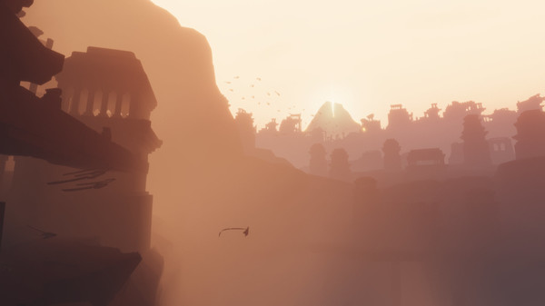
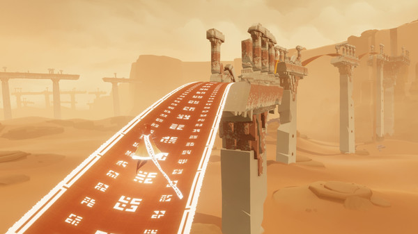
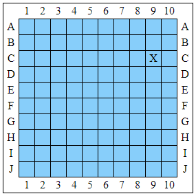

Começamos essa nova jornada de escrever sobre diversas coisas com Journey, um título perfeito para isso!

Já de cara aviso que na data deste post eu ainda não rejoguei ele, e é por isso que eu classifiquei esta análise como “Primeiras impressões”. Garanto que esse jogo merece uma segunda visita, e talvez mais algumas. A gameplay é curtinha, coisa de 2 horas, então você vai com certeza querer jogar mais de uma vez.

Sobre a parte técnica, joguei a versão da Steam, com todas as configurações de gráficos no médio. Acredito que meu notebook até consiga rodar com alguma configuração mais alta, mas acabei deixando no padrão que veio. Na hora de iniciar, ele recomendou mais, mas eu senti uns frame drops, então voltei tudo pro médio.

O gráfico é simples, mas muito bonito. As cores são coesas com a proposta de cada parte, e as animações são excelentes.

A física também é muito boa, tem muitas partículas voando por haver muita areia no jogo.

Sobre a jogabilidade, particularmente não gostei muito do movimento de câmera. Talvez pelos mapas parecerem bem abertos, achei que acabaria querendo explorar mais, mas a câmera não favorece. Ela costuma te “puxar” para o lado que devemos ir.

Também podemos falar de algumas mecânicas. Primeiro que não há falas, nem textos. Há um botão de ação em que o personagem faz barulhos, e tem uma outra utilidade extra a ser entendida jogando. A jogabilidade é 3D, o personagem pode pular e flutuar conforme o poder.

De toda a forma, é uma história “muda”, baseada muito em trilha sonora. E que trilha sonora! A música ambiente é maravilhosa, tudo funciona e encaixa muito bem.

A história brilha. Brilha muito! A jornada feita é incrível! E eu acho que não dá pra contar mais nada da história, sem atrapalhar a experiência de quem não jogou ainda.

O importante é que mesmo sem textos, a narrativa é super interessante. É também bastante interpretativa, provavelmente vai ser diferente para cada pessoa e também vai depender do momento da vida de cada um.

Dito isso, acho que é muito melhor você jogar do que ler a história a partir de um review. Como já disse, a primeira vez são só 2 horas de jogo (e você vai querer jogar de novo).

Para finalizar, gostaria de introduzir o formato em que desejo dar notas aos títulos aqui analisados: chamarei-a de Avaliação Cartesiana.

Na verdade, a idéia é um plágio da “Nota Naval” do Jogabilidade, onde as notas são dadas em 2 eixos de um plano cartesiano. Como eles explicam lá, no eixo X é avaliado o quão interessante é o objeto analisado com nota de 0 a 10, e no eixo Y é avaliada a qualidade com nota de A a J.

A minha nota na Avaliação Cartesiana para Journey é C9!

